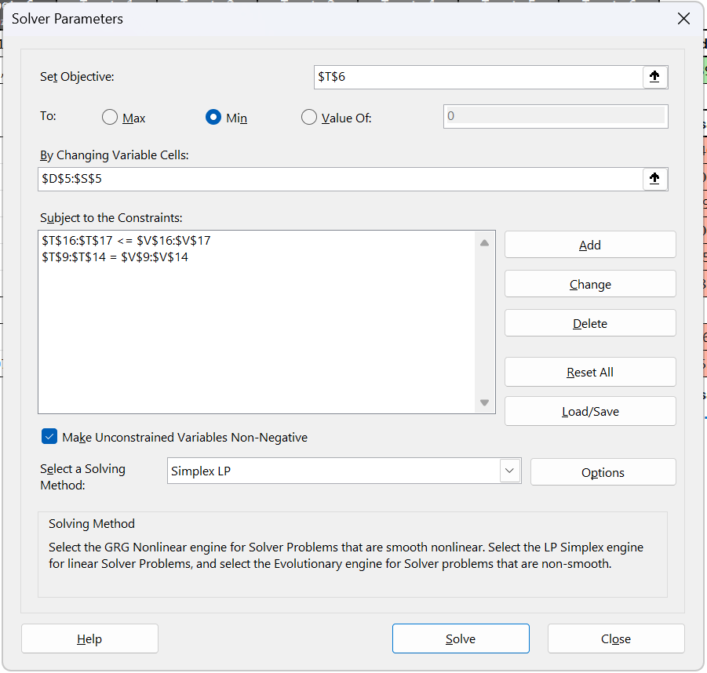
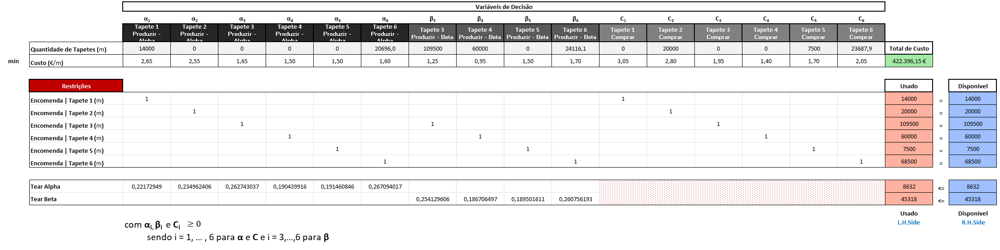

# ⚙️ Beirafio Production Optimization: A Linear Programming Case Study 🏭

    <!-- Project Links -->
    

## 📝 Description

This project applies **Linear Programming** to solve a real-world production planning problem for **Beirafio**, a traditional rug manufacturer. The goal is to determine the most cost-effective strategy to fulfill all customer orders for the next quarter (13 weeks) by optimizing the production across two types of looms (Alpha and Beta) and leveraging an external supplier.

## ✨ Objective

The primary objective is to develop and solve a mathematical model that **minimizes the total production and acquisition cost** for Beirafio, while adhering to all operational constraints. This involves:
*   Formulating a precise linear programming model.
*   Implementing and solving the model using Microsoft Excel Solver.
*   Analyzing the optimal solution to provide actionable business recommendations.
*   Conducting a sensitivity analysis to understand the impact of changes in costs and production capacity.

## 🎓 Project Context

This group project was developed for the **Otimização para Ciência de Dados** (*Optimization for Data Science*) course, part of the **[Licenciatura em Ciência de Dados](https://www.iscte-iul.pt/degree/code/0322/bachelor-degree-in-data-science)** (*Bachelor Degree in Data Science*) at **ISCTE-IUL** during the 2021/2022 academic year in the 1st year - 2nd semester.

## 🛠️ Technologies Used

This optimization problem was modeled and solved entirely within **Microsoft Excel**, using its powerful **Solver Add-in**.

    
    

---

## 🔢 Mathematical Model Formulation

The problem was modeled as a classic linear programming problem with the following components:

#### 1. Decision Variables
*   **αᵢ**: Quantity (in meters) of rug type `i` to **produce** on an **Alpha loom**. (i = 1 to 6)
*   **βᵢ**: Quantity (in meters) of rug type `i` to **produce** on a **Beta loom**. (i = 3 to 6)
*   **Cᵢ**: Quantity (in meters) of rug type `i` to **purchase** from the external supplier. (i = 1 to 6)

#### 2. Objective Function
The goal is to **minimize the total cost**, which is the sum of the costs of production on each loom and the cost of external acquisition.

**Minimize Cost = Σ (2.65α₁ + 2.55α₂ + ... + 1.60α₆) + Σ (1.25β₃ + ... + 1.70β₆) + Σ (3.05C₁ + ... + 2.05C₆)**

#### 3. Constraints
The model is subject to several constraints:
*   **Demand Constraints:** The sum of meters produced and purchased for each rug type `i` must equal the total order quantity.
    *   e.g., `α₁ + C₁ = 14000`
*   **Production Capacity Constraints:** The total time required to produce all rugs on a specific loom type cannot exceed the total available hours for that loom type over 13 weeks (after accounting for maintenance).
    *   e.g., `0.222α₁ + 0.235α₂ + ... ≤ 8632` (Total hours for Alpha looms)
*   **Non-Negativity:** All production and purchase quantities must be greater than or equal to zero.

## 🚀 How to Replicate the Solution

To run this optimization model, you will need Microsoft Excel with the **Solver Add-in** enabled.

1.  **Enable the Solver Add-in:**
    *   In Excel, go to `File` > `Options` > `Add-ins`.
    *   At the bottom, in the `Manage` box, select `Excel Add-ins` and click `Go`.
    *   In the Add-ins dialog box, check the **Solver Add-in** box and click `OK`.
    *   The Solver will now be available under the `Data` tab.

2.  **Open the Excel File:**
    *   Open the `Grupo12_OCD.xlsx` file provided in this repository.

3.  **Run the Solver:**
    *   Navigate to the `Data` tab and click on `Solver`.
    *   The Solver Parameters window will open, pre-configured with the model:
        *   **Set Objective:** The target cell containing the total cost formula.
        *   **To:** Set to `Min`.
        *   **By Changing Variable Cells:** The cells corresponding to our decision variables (αᵢ, βᵢ, Cᵢ).
        *   **Subject to the Constraints:** All demand and capacity constraints are listed here.
    *   Ensure the solving method is set to **"Simplex LP"**.
    *   Click **Solve** to find the optimal solution.

  

## 📊 Optimal Solution & Key Results

The optimal solution provides the exact quantity of each rug to either produce internally or purchase externally to meet demand at the minimum possible cost.

*   **Optimal Total Cost:** **€422,396.15**

The plan dictates a mix of strategies, such as producing certain high-volume rugs entirely on the more cost-effective looms, while purchasing others to free up production capacity.

  

A **Sensitivity Analysis** was also performed to understand how changes in costs and production capacity would impact the optimal solution, providing valuable insights for contract renegotiations and strategic planning.

## 👥 Team Members (Group 12)

*   **André Silvestre** (Nº104532)
*   **Diogo Catarino** (Nº104745)
*   **Francisco Gomes** (Nº104944)
*   **Rita Matos** (Nº104936)

## 🇵🇹 Note

This project was developed using Portuguese from Portugal 🇵🇹.